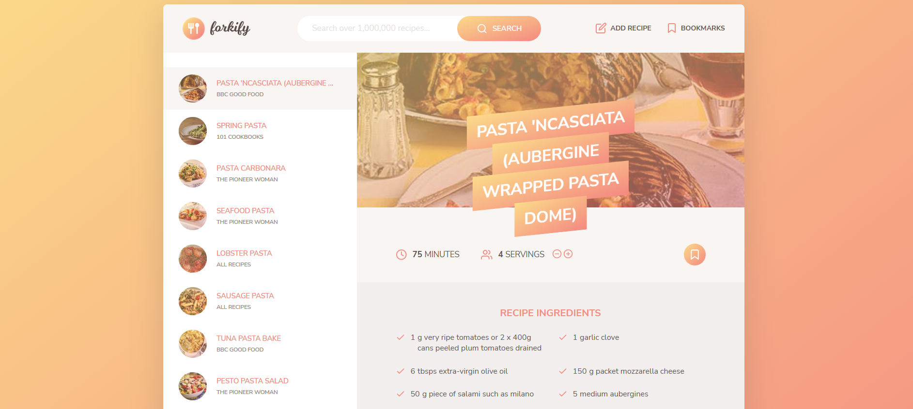

### Built With

- HTML
- CSS
- SASS
- JavaScript
- Parcel
- Babel
- Forkify API
- Libraries
 
# What is forkify
Forkify is a recipe web app using the [Forkify API](https://forkify-api.herokuapp.com/v2) to allow users to search, view, modify, bookmark and add recipes. It allows users to freely lookup dishes that any users prepher to cook themselves.

- Available search queries : [Queries](https://forkify-api.herokuapp.com/phrases.html)

### Flowchart

### Architecture

1. Search for Recipes

Use the search bar to find delicious recipes by typing in your desired keywords.
Once you hit enter, the app will fetch recipes from an API based on your search terms.
Results are displayed with pagination, allowing you to navigate through multiple recipe options.
Clicking on a recipe will show the cooking time, number of servings, and a list of ingredients.

2. Update the Number of Servings

You can easily adjust the number of servings for a recipe by using the serving adjustment buttons.
When you change the servings, the ingredient quantities will automatically update to match the new serving size, ensuring accurate measurements for your cooking.

3. Bookmark Recipes

Found a recipe you love? Simply click the bookmark icon to save it.
Bookmarked recipes are saved in a list that you can access at any time, making it easy to revisit your favorites.

4. Create Your Own Recipes

You can also upload your own recipes to the app. After uploading, your recipe will automatically be bookmarked for future reference.
These personal recipes will only be visible to you, keeping them private from other users.

5. Access Bookmarks and Recipes Later

The app uses local storage, so all your bookmarked recipes will remain saved, even if you leave the app.
When you return, your bookmarks and personal recipes will still be available for you to browse or cook from.

### How the app should look like

Please access the demo <a href="https://forkify-project-nine.vercel.app/" target="_blank"> here </a>

Spacial Thanks to
[Jonas schmedtmann](https://github.com/jonasschmedtmann)
for the challange

